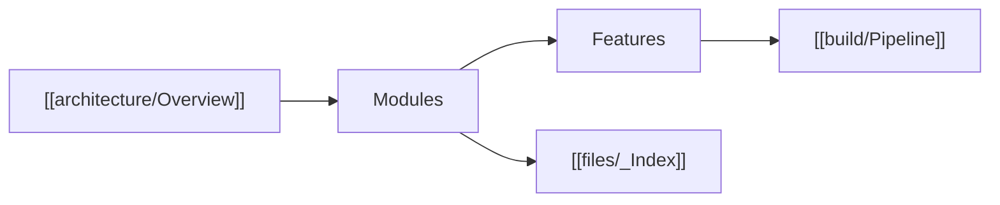

# Home

## Layers

1. **[[architecture/Overview|Architecture]]** — what exists, who owns it, how it connects.
2. **Modules** — what each area can do and how it is built:
   - [[modules/Core]]
   - [[modules/ECS]]
   - [[modules/Resources]]
   - [[modules/Render]]
   - [[modules/UI]]
   - [[modules/Audio]]
3. **Features** — implementation walkthroughs:
   - [[features/Init and Loop]]
   - [[features/ECS World]]
   - [[features/Events]]
   - [[features/Time]]
   - [[features/Assets]]
   - [[features/Materials and Sort]]
   - [[features/OpenGL]]
   - [[features/UI Markup]]
   - [[features/UI Input]]
   - [[features/Audio]]
   - [[features/Camera and Physics]]
   - [[features/Input Mapper]]
   - [[features/Logging]]
4. **[[build/Pipeline|Build pipeline]]** — configure → codegen → compile → copy assets → run.
5. **[[files/_Index|File index]]** — every first-party `.h` / `.cpp` / tool / test.

## Architecture shortcuts

- [[architecture/Runtime Loop]]
- [[architecture/Module Map]]
- [[architecture/Boundaries]]

## Build shortcuts

- [[build/CMake]]
- [[build/Asset Codegen]]
- [[build/Runtime Assets]]
- [[build/Game Consumer]]

## Mental model

A game is an `IGame` (usually `GameBase`). `Engine<GameT>` (windowed) constructs services with Boost.DI, loads catalogs into [[include.engine.resources.assets_db.h|AssetsDb]], registers [[include.engine.ecs.systems.h|engine systems]], then [[include.engine.core.engine_runtime.h|EngineRuntime]] runs the loop. Games never call OpenGL; they spawn ECS components and push work through events / UI commands. The backend executes a [[include.engine.render.command_buffer.h|CommandBuffer]].
