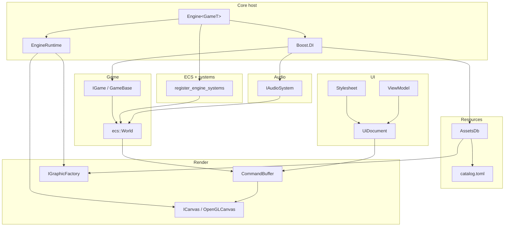

# Module map

Who talks to whom at runtime (windowed game).

## Init wiring

[[include.engine.core.engine.h|Engine::init]] (header-only template):

1. `runtime_.init_video()` — SDL video.
2. [[src.core.log.cpp|log::init]] with base path.
3. Boost.DI: `IFatalError` → `SdlFatalError`, `AssetsDb`, `InputSystem`, `IAudioSystem` → `AudioSystem`, command buffer / canvas / factory / backend from runtime, `IGame` → `GameT`.
4. Create window, `audio_->init()`.
5. `assets_->set_graphic_factory`, `set_root(exe/assets)`.
6. Load `assets/engine/catalog.toml` then optional `assets/catalog.toml`.
7. Load [[include.engine.builtin_ids.h|builtin::font_ui]] into NanoVG; `add_font` for every other catalog font.
8. `register_engine_systems`, `ui::apply_canvas_fit`.

Then [[include.engine.core.engine.h|Run]] → [[architecture/Runtime Loop]].

## Data that crosses modules

| Payload                           | From                  | To                                                |
| --------------------------------- | --------------------- | ------------------------------------------------- |
| `AssetId`                         | codegen / `.meta`     | `get`, materials, UI `Source`, audio events       |
| `MouseEvent` / `InputEvent`       | [[modules/Core]] poll | ECS event queues; UI hit-test; game Frame systems |
| `PlaySfxEvent` / `PlayMusicEvent` | game or UI command    | Audio phase                                       |
| `CmdDrawMesh`                     | Render system         | OpenGL backend                                    |
| `CmdDrawUI`                       | UiRender system       | NanoVG painter                                    |
| `MouseConsumed`                   | UI hit-test           | game must skip cell clicks                        |
|                                   |                       |                                                   |

## Tests vs window

[[build/CMake]]: root preset `vs` builds `engine` **without** `src/render/opengl/*` and without `engine_runtime.cpp`. GPU types return `NotReady` if factory is null. `Host` tests inject a fake `ICanvas`.

## See also

- [[architecture/Overview]]
- [[architecture/Boundaries]]
- [[modules/Core]]
