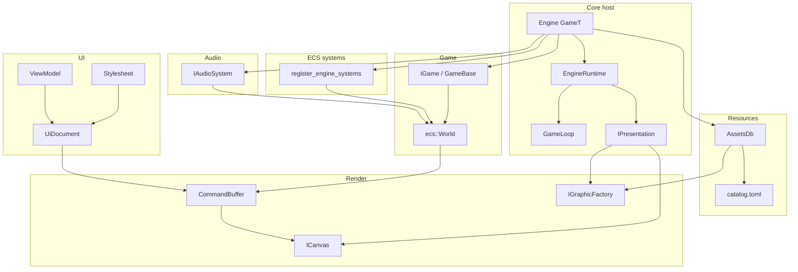

# Module map

Who talks to whom at runtime in a windowed game.

```mermaid
flowchart TB
  subgraph host [Core host]
    Eng["Engine GameT"]
    RT["EngineRuntime"]
    Loop["GameLoop"]
    Present["IPresentation"]
  end

  subgraph game [Game]
    IG["IGame / GameBase"]
    W["ecs::World"]
  end

  subgraph res [Resources]
    DB["AssetsDb"]
    Cat["catalog.toml"]
  end

  subgraph ecsmod [ECS systems]
    Sys["register_engine_systems"]
  end

  subgraph rnd [Render]
    CB["CommandBuffer"]
    Fac["IGraphicFactory"]
    CV["ICanvas"]
  end

  subgraph uimod [UI]
    XML["UiDocument"]
    CSS["Stylesheet"]
    VM["ViewModel"]
  end

  subgraph aud [Audio]
    AS["IAudioSystem"]
  end

  Eng --> RT
  Eng --> IG
  Eng --> DB
  Eng --> AS
  RT --> Loop
  RT --> Present
  Present --> CV
  Present --> Fac
  IG --> W
  Eng --> Sys
  Sys --> W
  DB --> Cat
  DB --> Fac
  W --> CB
  XML --> CB
  CSS --> XML
  VM --> XML
  AS --> W
  CB --> CV
```

## Init wiring

`Engine::init` is a thin template in `include/engine/core/engine.h` over the non-template `EngineHost` (`src/core/engine_host.cpp`), which builds every service. The order is [Runtime Loop](Runtime%20Loop.md).

## Data that crosses modules

| Payload | From | To |
| --- | --- | --- |
| `AssetId` | codegen / `.meta` | `get`, materials, UI `source`, audio events |
| `MouseEvent` / `InputEvent` | [Core](../modules/Core.md) poll | ECS event queues, UI hit-test, game Frame systems |
| `PlaySfxEvent` / `PlayMusicEvent` | game or UI command | Audio phase |
| `CmdDrawMesh` / `CmdDrawParticles` | Render system | OpenGL backend |
| `CmdDrawUI` | UI render system | NanoVG painter |
| `Presentation.mouse` | UI hit-test | `sync_frame` click-through on that same object. `ctx<ui::MouseConsumed>()` does not see the hits |
| `{tr}` key | string-table asset | UI bind writes `Element::text` |
| `HttpResult` | [Net](../modules/Net.md) backend (worker thread or browser callback) | the sender's `HttpCall`, in `HttpClient::poll` |

## Tests vs window

[CMake](../build/CMake.md): the root preset `vs` builds `engine` without `src/render/opengl/*` and without `engine_runtime.cpp`. GPU types return `AssetError::NotReady` when the graphic factory is null. `Host` tests inject a fake `ICanvas`.

## See also

- [Overview](Overview.md)
- [Boundaries](Boundaries.md)
- [Core](../modules/Core.md)
