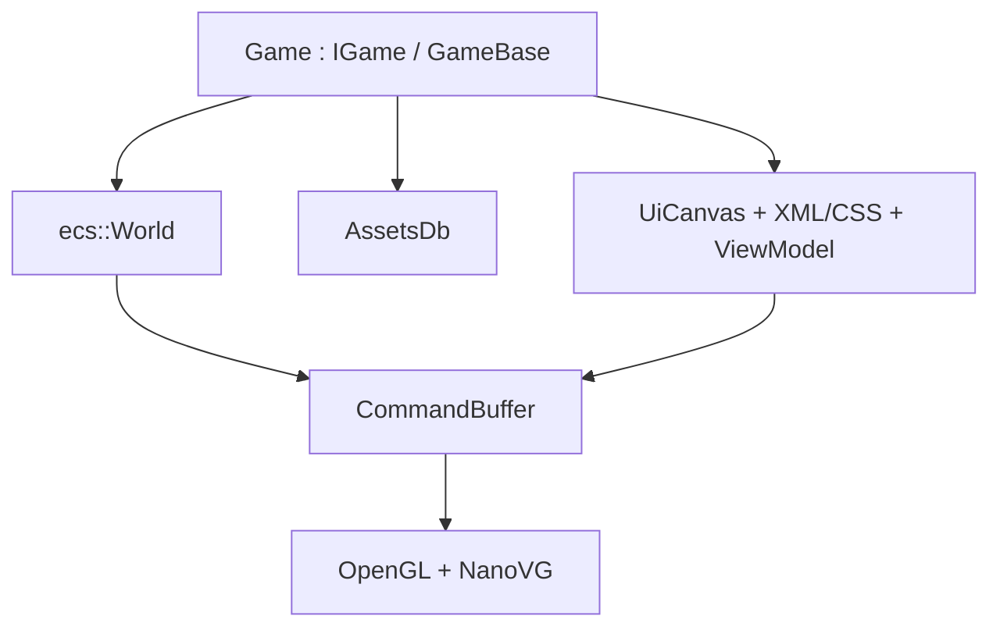

# Architecture overview

Wind is a **static C++23 library**: a small, embeddable 2D game engine. The product name is Wind; the CMake target and namespace are `engine`.

Public API lives in `include/engine/` (`#include <engine/…>`). Implementation and private headers live in `src/`. Third party is git submodules under `external/` (no FetchContent, no EnTT).

## Layers of this vault

| Slice | Question | Start here |
| --- | --- | --- |
| Architectural | What are the modules and how do they meet? | this note, [[architecture/Module Map]], [[architecture/Runtime Loop]] |
| Modular | What can a module do, and how is it coded? | [[modules/Core]] … [[modules/Audio]] |
| Detailed | How is a feature implemented? | [[features/Init and Loop]] |
| Build | How does a binary appear on disk? | [[build/Pipeline]] |

## What a game sees

- Lifecycle: [[include.engine.igame.h|IGame]] / [[include.engine.igame.h|GameBase]].
- Data: one [[include.engine.ecs.world.h|World]] (entities + `ctx` resources + systems).
- Assets: GUID catalog, `get<T>` / `try_get<T>` ([[features/Assets]]).
- UI: markup + stylesheet + MVVM, not `onClick` trees ([[features/UI Markup]]).
- Draw: `Renderable` + `Transform` → sort → `CmdDrawMesh`; UI → `CmdDrawUI` ([[features/Materials and Sort]]).

Windowed host: [[include.engine.core.engine.h|Engine&lt;GameT&gt;]] in [[include.engine.engine.h|engine.h]] (only if `ENGINE_WITH_WINDOW`). Headless `engine_tests` never call `Engine::run`.

## Module responsibilities

| Module                | Owns                                                     | Does not own                     |
| --------------------- | -------------------------------------------------------- | -------------------------------- |
| [[modules/Core]]      | Loop, time, input poll, DI, fatal errors, log            | Gameplay, GPU objects            |
| [[modules/ECS]]       | Entities, views, schedules, events, camera, AABB physics | OpenGL, XML                      |
| [[modules/Resources]] | `.meta`, catalog, codegen, `get`                         | Painting pixels                  |
| [[modules/Render]]    | Materials, commands, sort, OpenGL/NanoVG backends        | Asset GUIDs, UI bind names       |
| [[modules/UI]]        | XML/CSS parse, layout, hit-test, MVVM                    | World sprites                    |
| [[modules/Audio]]     | SFX pool, music A/B, looping handles                     | File GUIDs (those are Resources) |

How they connect: [[architecture/Module Map]]. What stays out of public headers: [[architecture/Boundaries]].

## Related spec

SDD §3 (layout), §4 (host), §5 (DI). Code wins over this vault if they drift; vault should be updated with the code.
