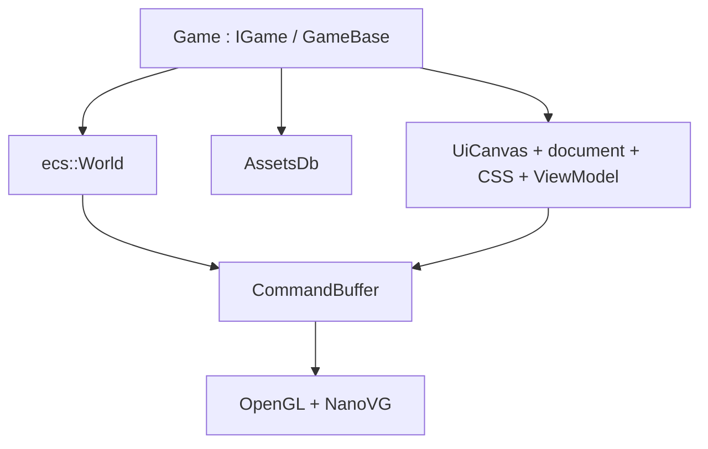

# Architecture overview

Wind is a C++23 library: a 2D game engine for production titles. An exported game links it statically. The editor build (`ENGINE_EDITOR`) makes it a shared library. The product name is Wind. The CMake target and namespace are `engine`.

Public API lives in `include/engine/` (`#include <engine/…>`). Implementation and private headers live in `src/`. Third party is git submodules under `external/` (no FetchContent, no EnTT).

## What a game sees

```mermaid
flowchart TB
  Game["Game : IGame / GameBase"]
  World["ecs::World"]
  Assets["AssetsDb"]
  UI["UiCanvas + document + CSS + ViewModel"]
  Cmd["CommandBuffer"]
  GL["OpenGL + NanoVG"]

  Game --> World
  Game --> Assets
  Game --> UI
  World --> Cmd
  UI --> Cmd
  Cmd --> GL
```

- Lifecycle: `IGame` and `GameBase` in `include/engine/igame.h`.
- Data: `Worlds` holds any number of `ecs::World` (entities, `ctx` resources, systems). Each world has its own time. `ApplicationState` is one per process.
- Assets: GUID catalog, `get<T>` / `try_get<T>`. See [Assets](../features/Assets.md).
- UI: XML and/or `ui::Node`, a stylesheet, and MVVM. See [UI Markup](../features/UI%20Markup.md).
- Draw: `Renderable` or `Sprite` plus `Transform`, then sort, then `CmdDrawMesh`. Particles are `CmdDrawParticles`. UI is `CmdDrawUI`. See [Materials and Sort](../features/Materials%20and%20Sort.md).

The windowed host is `Engine<GameT>` in `include/engine/core/engine.h`, included from `include/engine/engine.h` only when `ENGINE_WITH_WINDOW` is set. Headless `engine_tests` do not call `Engine::run`.

`kBuildId` in the generated `<engine/build_id.h>` identifies the engine build a game was compiled against. `build_id()` (`include/engine/core/build_info.h`) returns the value compiled into `engine`. See [CMake](../build/CMake.md#build-id).

## Module responsibilities

| Module | Owns | Does not own |
| --- | --- | --- |
| [Core](../modules/Core.md) | Loop, time, input poll, composition root, fatal errors, log, window control | Gameplay, GPU objects |
| [ECS](../modules/ECS.md) | Entities, views, schedules, events, camera, AABB and circle physics | OpenGL, XML |
| [Resources](../modules/Resources.md) | `.meta`, catalog, codegen, `get` | Painting pixels |
| [Render](../modules/Render.md) | Materials, commands, sort, OpenGL and NanoVG backends | Asset GUIDs, UI bind names |
| [UI](../modules/UI.md) | XML and C++ builder, CSS, layout, hit-test, MVVM | World sprites |
| [Localization](../modules/Localization.md) | String tables, `{tr}`, plural messages | Which locale the player picked |
| [Audio](../modules/Audio.md) | SFX pool, music A/B, looping handles | File GUIDs (those are Resources) |
| [Haptics](../modules/Haptics.md) | Vibration duration and intensity | A CMake feature flag |

How they connect: [Module Map](Module%20Map.md). What stays out of public headers: [Boundaries](Boundaries.md). Product rules: [Principles](Principles.md), [Scope](Scope.md).

If a page disagrees with code, code wins and the page should be updated in the same change.
