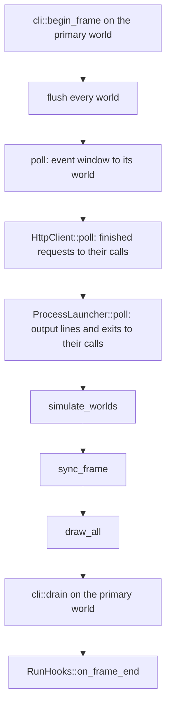

# Runtime loop

Windowed games enter through `ENGINE_GAME` (`include/engine/game_entry.h`), which runs `Engine<GameT>` (`include/engine/core/engine.h`) on an `EngineHost` (`include/engine/core/engine_host.h`). Headless tests use `Host` (`include/engine/core/host.h`), which shares `flush_worlds` and `simulate_worlds` (`src/core/frame_step.cpp`) and does not poll SDL. The process owns a `Worlds`. Each world has its own clock. The frame walks them in `add` order. Worlds do not share a command buffer, so that order does not change the picture.

## `Engine::init`

`init` returns true immediately when it has already succeeded. The steps are `EngineHost` calls.

1. `EngineHost::init`:
   1. `runtime.init_video()`. SDL video, inside `SdlGlPresentation`.
   2. `log::init(runtime.base_path())`. File sink `<base>/game.log`.
   3. Construct `SdlFatalError`, `InputSystem`, `AssetsDb`, `AudioSystem`, `HapticsSystem`, `HttpClient`, `ProcessLauncher`, `Worlds`, and the `EngineServices` over them (assets, input, audio, haptics, http, processes, windows, graphics, backend, canvas, commands, worlds).
   4. `input.set_router` to `Worlds::world_for`. Attach the fatal hook to `Worlds::application_state` and the native window.
2. Construct `GameT` with `services()`. `GameBase` calls `Worlds::add` for its world. Systems are not registered yet: the window and catalogs do not exist.
3. `EngineHost::open_primary(game.primary_window())`:
   1. `runtime.create_window`. Attach the fatal hook again so it sees the created window.
   2. `audio.init()`, then `haptics.init()`, then `http.init()`. An HTTP failure only logs a warning; requests then answer `Unsupported`.
   3. `assets.set_graphic_factory` and `set_root(runtime.assets_root())`. An empty root is fatal.
   4. Load `assets/engine/catalog.toml`. Failure is fatal.
   5. Load `builtin::font_ui` into the primary window's UI atlas. Other fonts and UI images load later, when `run_ui_render` sees them referenced.
   6. `Worlds::set_deps`. That registers simulation systems on the game world.

   Any failure disposes the host and `init` returns false.
4. `EngineHost::load_catalog(assets_root())`: `assets/catalog.toml`. `MetaError::Io` (file absent) is success. Any other error is fatal.
5. `EngineHost::attach_game(game)`: if `window_icon()` is set, `get<render::TextureDesc>` and `set_window_icon`. Then `bind_window(kPrimaryWindow)`, `enable_ui`, `enable_audio`, `write_window_size` (sends a resize event), `ui::apply_canvas_fit`.

`run` calls `EngineHost::run` with `RunHooks` whose `on_start` and `on_quit` call the game. `EngineHost::run` calls `runtime.run`, then `dispose`. `dispose` disposes audio, haptics, and HTTP (cancelling every pending call) and shuts the runtime down. A second `dispose` is a no-op.

## `RunHooks`

`include/engine/core/run_hooks.h`. `GameLoop::run` and `EngineRuntime::run` take it instead of a game. An empty function is skipped.

| Hook | When |
| --- | --- |
| `on_start` | in `GameLoop::begin`, after `attach_loop`, before the first frame |
| `on_frame_end` | last in every `tick`, after `cli::drain`. Web runs `tick` from the main-loop callback, so it is called there too. Not called from `reentrant_tick` |
| `on_quit` | once, in `GameLoop::end`, before the host dispose callback |

`on_frame_end` may set `ApplicationState::running` back to true. The loop reads `running` after the hook, so the loop goes on. The editor uses this to stop a game that quit and keep running itself.

## `GameLoop::begin`

`EngineRuntime::run` starts `GameLoop` (`src/core/game_loop.cpp`).

1. `presentation_->attach_loop` (layout painter on every UI world, modal-loop hook). Worlds created later with `enable_ui` get the same painter.
2. `RunHooks::on_start`.
3. `ui::apply_canvas_fit` on every world that draws UI.
4. `ApplicationState::running = true`.
5. `cli::start()` when `ENGINE_CLI_SERVER` is defined. Otherwise the call is empty.

Web (`Platform::Web`) then uses `emscripten_set_main_loop_arg` with `simulate_infinite_loop = 1`. Every other platform loops `tick` while `running` is true, then `end`.

## One `tick`

`cli::begin_frame` and `cli::drain` use the world bound to `kPrimaryWindow`. No binding means those calls are skipped. `reentrant_tick` is the same slice without flush, without either poll, and without `on_frame_end`, so HTTP results wait for the frame after the drag. Windows calls it from inside `SDL_PollEvent` while a modal move or size loop is running. It shares the frame clock, so the frame that resumes after a drag does not replay the drag.

### `simulate_worlds`

1. `reset_pointer_frame` clears `Presentation.mouse` once. `begin_frame` on every world with UI. That fits canvases. It does not clear mouse consumption.

   `run_input` calls `begin_frame` again when the frame schedule runs. Each call starts with `profiler_commit_frame`. The second commit does not push a canvas slot, so a canvas slot is one whole tick: input, bindings, stylesheets, layout, motion, and paint. The shared ring alternates between the pre-schedule fit and the `run_input` fit with that tick's `commands`. See [UI Profiler](../features/UI%20Profiler.md).
2. `advance` every world's clock with the same `real_dt`. Wall dt is clamped to `kMaxFrameDt` (0.25s). While the process is not paused and that world is stepping, the clock runs up to `kMaxFixedSteps` (8) steps of `kFixed` (1/60s) and drops leftover accumulator past the cap.
3. If audio is non-null, `audio->update` once with that clamped `real_dt`.
4. For each world, in `add` order: `Schedule::Fixed` when it is stepping and the process is not paused. `Schedule::Frame` when it is stepping and either the process is not paused or a window is bound to it. An empty `ctx<BoundWindows>()` makes `run_render` return before any command-buffer clear. A non-empty list clears those buffers, then returns without pushing scene commands when the `Renderable`+`Transform`, `Sprite`+`Transform`, and `ParticleEmitter` views are all empty, when `ActiveCamera`'s entity is not valid, or when that entity has no `Camera` or `Transform` (fatal). The sorted list is pushed only after a live camera with both components, with `window_size_for` (`Presentation.sizes`) for that id. `run_ui_render` then writes UI.

`Time` fields written by each clock: `delta_time`, `fixed_delta_time`, `alpha`, `accumulator`.

### Schedules

`register_engine_systems` registers simulation, UI, and audio on one world and sets `ctx<EngineSystemsRegistered>`. `Host` uses it. `EngineHost` does not call it: `set_deps` registers simulation on every world that exists, `Worlds::add` registers simulation on later worlds once `set_deps` has run, and `enable_ui` and `enable_audio` add the other two. Each set is guarded by its own `ctx` flag, so the order never registers a system twice. `enable_ui` and `enable_audio` can be called on more than one world.

| Schedule | Phases that run | Engine systems |
| --- | --- | --- |
| `Fixed` | `Physics`, then `Game` | `run_physics` on `Physics` |
| `Frame` | `Input`, `Game`, `Bind`, `Audio`, `Render`, `UiRender` | see below |

Frame systems, in phase order:

| Phase | System |
| --- | --- |
| `Input` | `run_input` calls `begin_frame`, then drains `MouseEvent` into UI |
| `Input` | `run_splash_timers` (`Time::delta_time`, including while paused) |
| `Game` | `run_sprite_animations` |
| `Game` | `run_particles` |
| `Bind` | `run_bind` |
| `Audio` | `PlaySfxEvent` / `PlayMusicEvent` via `EventCursor`, then `get<Sound>` |
| `Render` | `run_render`. An empty `ctx<BoundWindows>()` returns before a command-buffer clear. A non-empty list clears those buffers, then returns without scene commands when the `Renderable`+`Transform`, `Sprite`+`Transform`, and `ParticleEmitter` views are all empty, when `ActiveCamera`'s entity is not valid, or when that entity has no `Camera` or `Transform` (fatal). The sorted draws are pushed only after a live camera with both components, each with `window_size_for` |
| `UiRender` | `run_ui_render` (`CmdDrawUI` per canvas, per window; `inspector_retarget` first while the inspector is attached) |

`Phase::Physics` is not a frame phase. `kFixedPhases` is Physics then Game. `kFramePhases` omits Physics.

After simulate, `sync_frame` applies click-through from `Worlds::presentation().mouse` (the set the hit-test filled) and syncs text-input activation. `draw_all` executes each window's command buffer. `cli::drain` answers queries from the painted frame and arms a `click` for the next `begin_frame`.

## `GameLoop::end`

`cli::stop`, detach the presentation, then `LoopShutdown::complete`: `RunHooks::on_quit`, then the host dispose callback (`EngineHost::dispose`). On web, `run` does not return from the infinite main loop, so `end` is what still runs dispose when `running` becomes false.

## `Host::tick`

Used by tests. The game is already constructed with `Worlds`. The constructor registers systems, binds `kPrimaryWindow`, enables UI and audio, writes the primary window size, calls `on_start`, and applies canvas fit. Each `tick`: `flush_worlds`, `simulate_worlds`, `canvas.draw`. Destructor calls `on_quit`. No CLI, no SDL poll.

## See also

- [Core](../modules/Core.md)
- [ECS](../modules/ECS.md)
- [CMake](../build/CMake.md)
